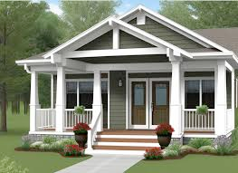

# porch (n)

- /pɔːtʃ/ [🔊](https://www.oxfordlearnersdictionaries.com/media/english/uk_pron/p/por/porch/porch__gb_1.mp3)
- /pɔːrtʃ/ [🔊](https://www.oxfordlearnersdictionaries.com/media/english/us_pron/p/por/porch/porch__us_1.mp3)

## (Buildings, Houses and homes)a small area at the entrance to a building, such as a house or a church, that is covered by a roof and often has walls (cổng vòm)

