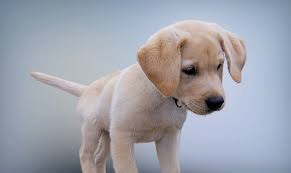
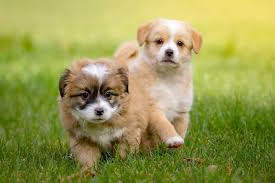

# puppy (n)

/ˈpʌpi/ [🔊](https://www.oxfordlearnersdictionaries.com/media/english/uk_pron/p/pup/puppy/puppy__gb_2.mp3) [🔊](https://www.oxfordlearnersdictionaries.com/media/english/us_pron/p/pup/puppy/puppy__us_1.mp3)

Also [pup]()

## (Animals) a young dog (chó con)

