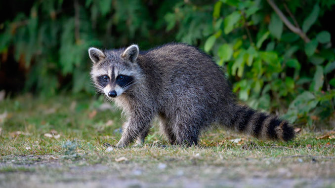

# raccoon (n)

- /rəˈkuːn/ [🔊](https://www.oxfordlearnersdictionaries.com/media/english/uk_pron/r/rac/racco/raccoon__gb_1.mp3)
- /ræˈkuːn/ [🔊](https://www.oxfordlearnersdictionaries.com/media/english/us_pron/r/rac/racco/raccoon__us_1.mp3)

## (Animals) a small North American animal with grey-brown fur, black marks on its face and a thick tail (gấu mèo Bắc Mỹ)

## the fur of a raccoon (bộ lông gấu mèo Bắc Mỹ)