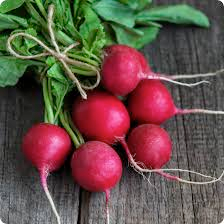
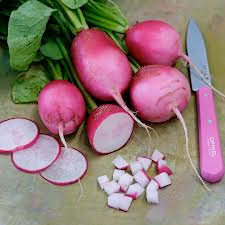

# radish (n)

/ˈrædɪʃ/ [🔊](https://www.oxfordlearnersdictionaries.com/media/english/uk_pron/r/rad/radis/radish__gb_1.mp3) [🔊](https://www.oxfordlearnersdictionaries.com/media/english/us_pron/r/rad/radis/radish__us_1.mp3)

## (Food) a small red and white root vegetable with a strong taste, eaten raw in salads (củ cải)

