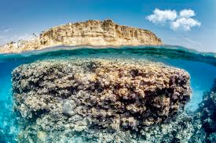

# reef (n)

/riːf/ [🔊](https://www.oxfordlearnersdictionaries.com/media/english/uk_pron/r/ree/reef_/reef__gb_1.mp3) [🔊](https://www.oxfordlearnersdictionaries.com/media/english/us_pron/r/ree/reef_/reef__us_1.mp3)

## (Geography) a long line of rocks or sand near the surface of the sea (rặn đá ngầm)

