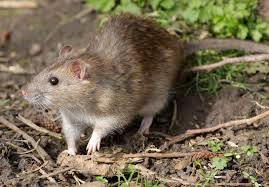
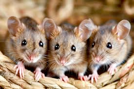
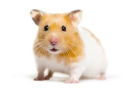
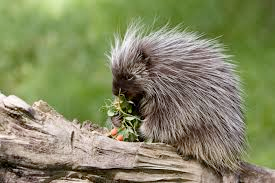
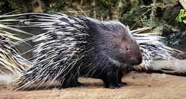

# rodent (n)

/ˈrəʊdnt/ [🔊](https://www.oxfordlearnersdictionaries.com/media/english/uk_pron/r/rod/roden/rodent__gb_1.mp3) [🔊](https://www.oxfordlearnersdictionaries.com/media/english/us_pron/r/rod/roden/rodent__us_1.mp3)

ro-dent /ˈrəʊ-dnt/

plural **rodents**

## 1.

### a gnawing mammal of an order that includes rats, mice, squirrels, hamsters, porcupines, and their relatives, distinguished by strong constantly growing incisors and no canine teeth. They can constitute the largest order of mammals

động vật có vú gặm nhấm

Rat

 

Mice

 

Squirrel

Hamster

Porcupine

 