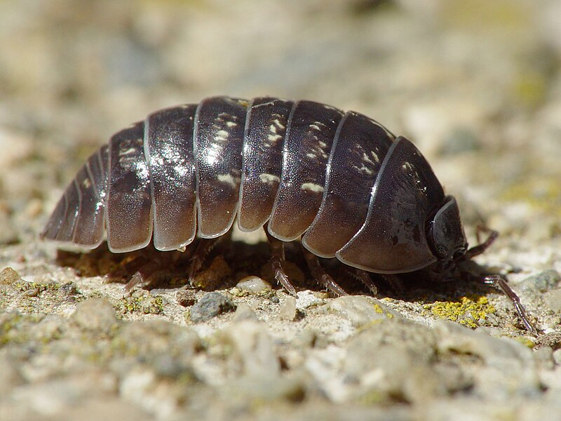

# roly-poly (n)

- /ˌrəʊli ˈpəʊli/ [🔊](https://www.oxfordlearnersdictionaries.com/media/english/uk_pron/r/rol/roly_/roly_poly_1_gb_1.mp3) [🔊](https://www.oxfordlearnersdictionaries.com/media/english/us_pron/r/rol/roly_/roly_poly_1_us_1.mp3)

## (Insects) roly-poly bug - also pill bug, sow bug, wood louse (rận gỗ hay bọ viên)

