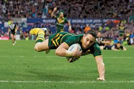

# rugby (n)

/ˈrʌɡbi/ [🔊](https://www.oxfordlearnersdictionaries.com/media/english/uk_pron/r/rug/rugby/rugby__gb_1.mp3) [🔊](https://www.oxfordlearnersdictionaries.com/media/english/us_pron/r/rug/rugby/rugby__us_2.mp3)

## a game played by two teams of 13 or 15 players, using an oval ball which may be kicked or carried. Teams try to put the ball over the other's team line

Topic [Sports: ball and racket sports](../topics/sports-ball-and-racket-sports.md#sports-ball--racket-sports)

Also [rugby football]()

Bóng bầu dục

