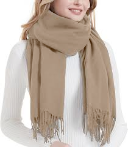

# scarf (n)

- /skɑːf/ [🔊](https://www.oxfordlearnersdictionaries.com/media/english/uk_pron/s/sca/scarf/scarf__gb_2.mp3)
- /skɑːrf/ [🔊](https://www.oxfordlearnersdictionaries.com/media/english/us_pron/s/sca/scarf/scarf__us_1.mp3)

Plural [scarves]() /skɑːvz/ [🔊](https://www.oxfordlearnersdictionaries.com/media/english/uk_pron/s/sca/scarv/scarves__gb_1.mp3) /skɑːrvz/ [🔊](https://www.oxfordlearnersdictionaries.com/media/english/us_pron/s/sca/scarv/scarves__us_1.mp3)

## (Clothes and fashion) a piece of cloth that is worn around the neck or over the hair or shoulders to keep warm or for decoration (khăn quàng/choàng cổ)

