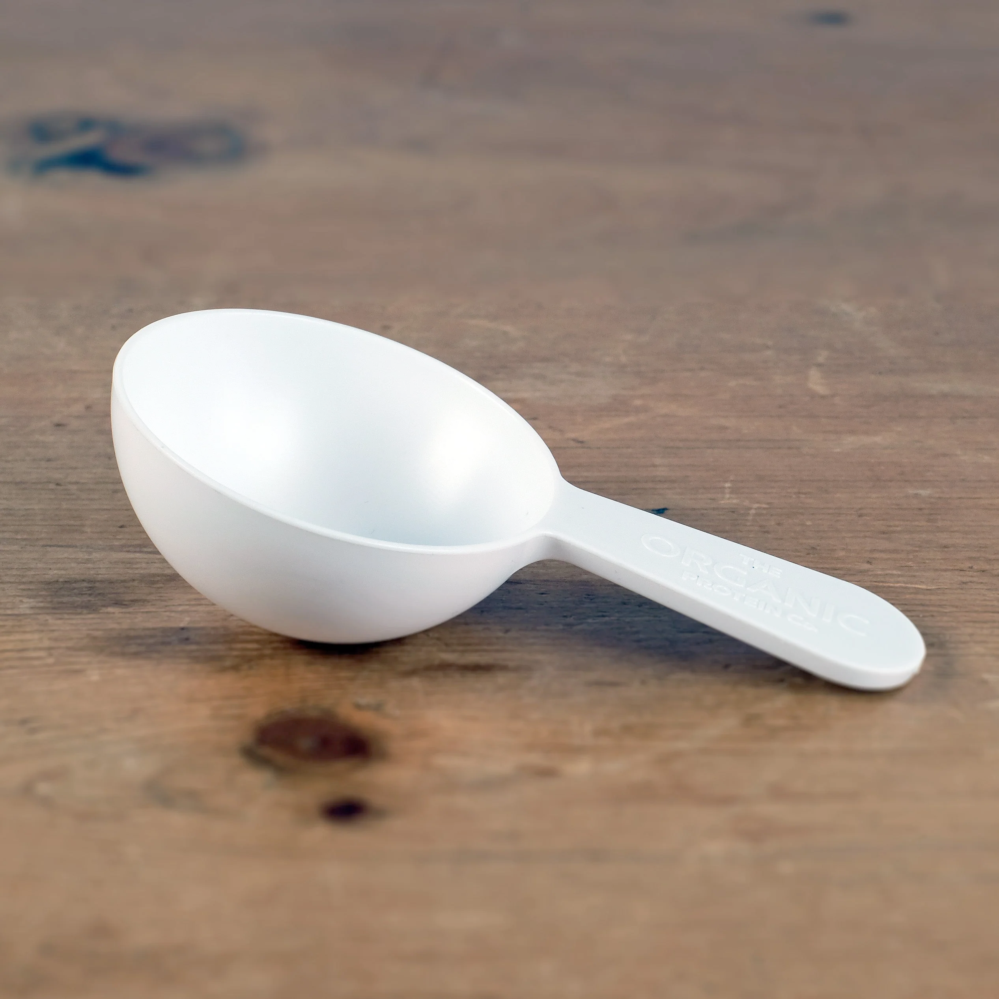
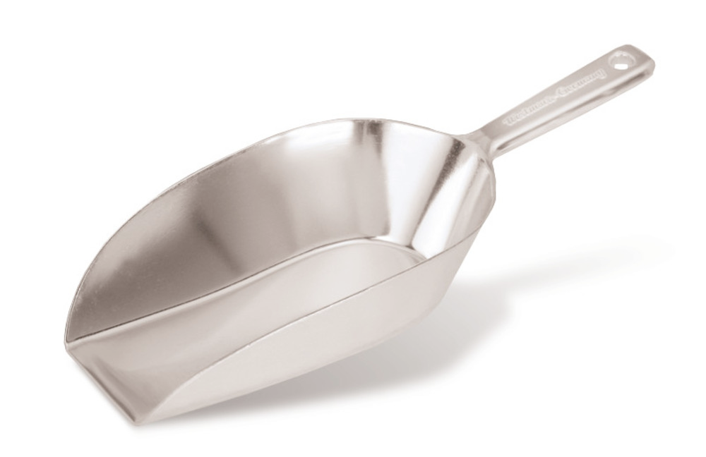

# scoop (n)

/skuːp/ [🔊](https://www.oxfordlearnersdictionaries.com/media/english/uk_pron/s/sco/scoop/scoop__gb_1.mp3) [🔊](https://www.oxfordlearnersdictionaries.com/media/english/us_pron/s/sco/scoop/scoop__us_1.mp3)

## (Cooking and eating) a tool like a large spoon with a deep bowl, used for picking up substances in powder form like flour, or serving food like ice cream (muỗng)

## the amount picked up by a scoop