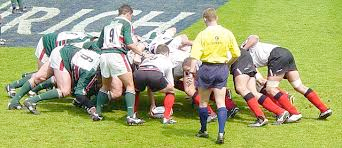

# scrum (n)

/skrʌm/ [🔊](https://www.oxfordlearnersdictionaries.com/media/english/uk_pron/s/scr/scrum/scrum__gb_1.mp3) [🔊](https://www.oxfordlearnersdictionaries.com/media/english/us_pron/s/scr/scrum/scrum__us_1.mp3)

## a part of a [rugby](../r/rugby-n.md#a-game-played-by-two-teams-of-13-or-15-players-using-an-oval-ball-which-may-be-kicked-or-carried-teams-try-to-put-the-ball-over-the-others-team-line) game when players from both sides link themselves together in a group, with their heads down, and push against the other side. The ball is then thrown between them and each side tries to get it.

Topic [Sports: ball and racket sports](../topics/sports-ball-and-racket-sports.md#sports-ball--racket-sports)

Also [scrummage]()

## the group of players who link themselves together in a scrum

## a crowd of people who are pushing each other