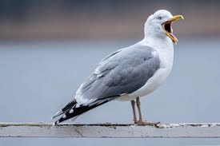

# seagull (n)

/ˈsiːɡʌl/ [🔊](https://www.oxfordlearnersdictionaries.com/media/english/uk_pron/s/sea/seagu/seagull__gb_1.mp3) [🔊](https://www.oxfordlearnersdictionaries.com/media/english/us_pron/s/sea/seagu/seagull__us_1.mp3)

Also [gull]()

## (Animals, Birds) a seabird with long wings and usually white and grey or black feathers. There are several types of seagull (hải âu; mòng biển; chim báo bão)

