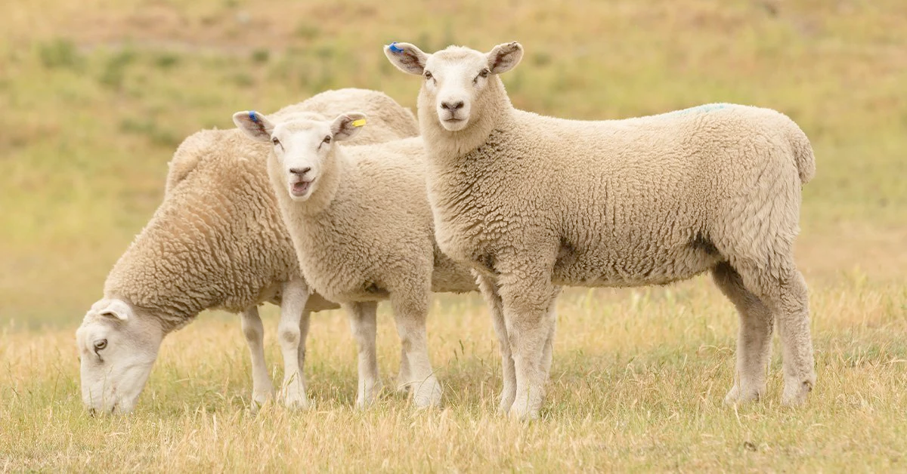
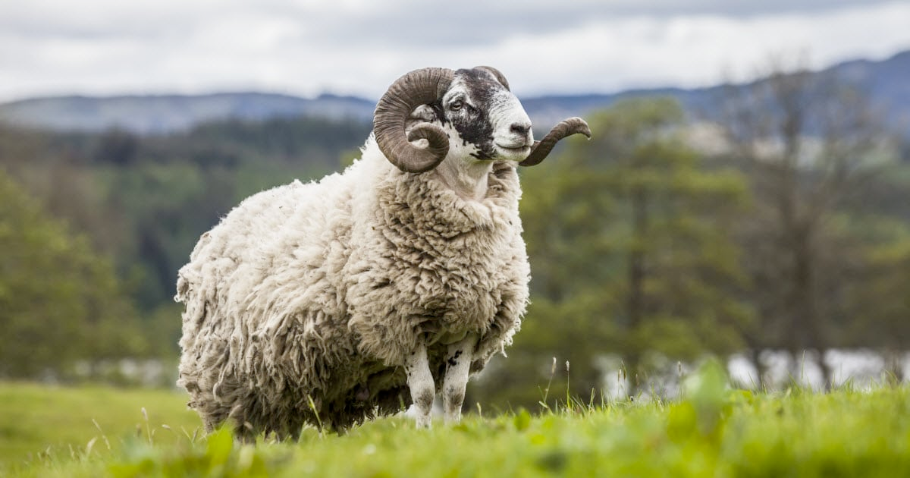
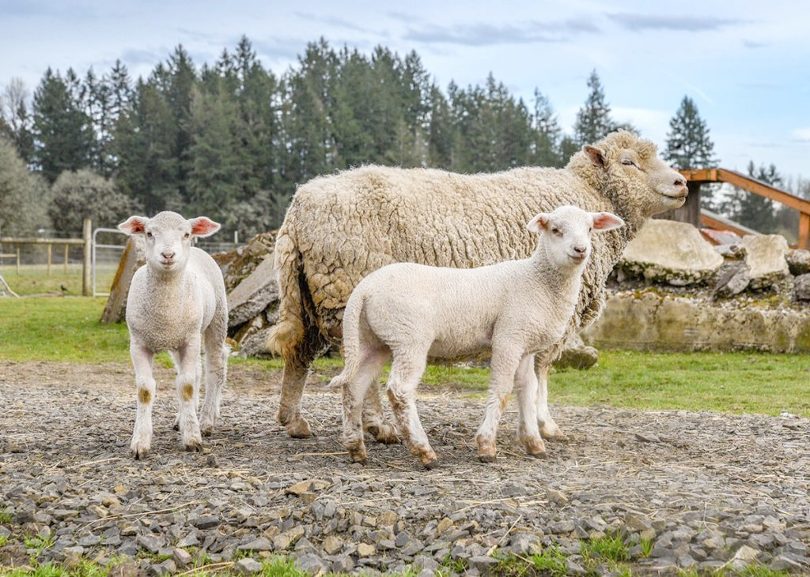

# sheep (n)

/ʃiːp/ [🔊](https://www.oxfordlearnersdictionaries.com/media/english/uk_pron/s/she/sheep/sheep__gb_2.mp3) [🔊](https://www.oxfordlearnersdictionaries.com/media/english/us_pron/s/she/sheep/sheep__us_1.mp3)

## (Animals) an animal with a thick coat, kept on farm for its meat or its wool (con cừu)

