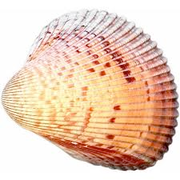
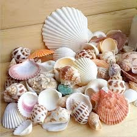

# shell (n)

/ʃel/ [🔊](https://www.oxfordlearnersdictionaries.com/media/english/uk_pron/s/she/shell/shell__gb_1.mp3) [🔊](https://www.oxfordlearnersdictionaries.com/media/english/us_pron/s/she/shell/shell__us_1.mp3)

## (Fish and shellfish, Animals) the hard outer part of eggs, nuts, some seeds, and some animals (vỏ trứng/sò; mai rùa)

