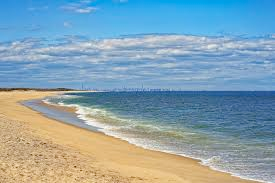

# shore (n)

- /ʃɔː(r)/ [🔊](https://www.oxfordlearnersdictionaries.com/media/english/uk_pron/s/sho/shore/shore__gb_1.mp3)
- /ʃɔːr/ [🔊](https://www.oxfordlearnersdictionaries.com/media/english/us_pron/s/sho/shore/shore__us_1.mp3)

## (Geography) the land along the edge of the sea, the ocean, or a lake (bờ biển/hồ)

- On her way back to the shore, a whale jumped over her boat and ate six of the fish.

