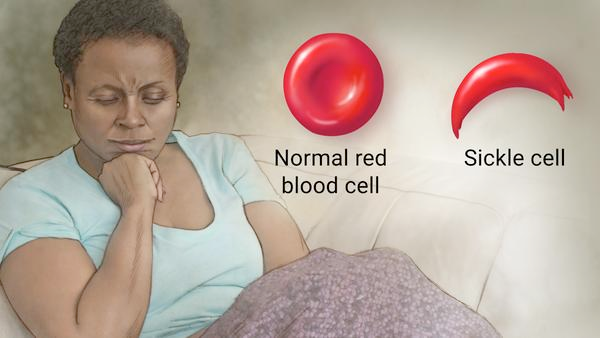

# sickle cell anaemia (n)

/ˌsɪkl sel əˈniːmiə/ [🔊](https://www.oxfordlearnersdictionaries.com/media/english/uk_pron/s/sic/sickl/sickle_cell_anaemia_1_gb_1.mp3) [🔊](https://www.oxfordlearnersdictionaries.com/media/english/us_pron/s/sic/sickl/sickle_cell_anaemia_1_us_1.mp3)

si-ckle-cell-a-nae-mi-a /ˌsɪ-kl-sel-ə-ˈniː-mi-ə/

plural **sickle cell anaemias**

also **sickle cell anemia** (North American English); plural **sickle cell anemias**

## 1.

### a severe hereditary form of anaemia in which a mutated form of hemoglobin distorts the red blood cells into a crescent at low oxygen levels. It is most common among those of African descent.

hồng cầu hình liềm

