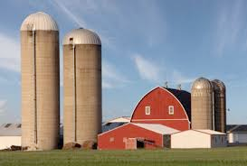

# silo (n)

/ˈsaɪləʊ/ [🔊](https://www.oxfordlearnersdictionaries.com/media/english/uk_pron/s/sil/silo_/silo__gb_1.mp3) [🔊](https://www.oxfordlearnersdictionaries.com/media/english/us_pron/s/sil/silo_/silo__us_1.mp3)

si-lo /ˈsaɪ-ləʊ/

plural [silos]()

## a tall tower on a farm used for storing grain, etc.

Topic [Farming](../topics/farming.md#farming)

## the underground place where nuclear weapons or dangerous substances are kept

Topic [War and conflict](../topics/war-and-conflict.md#war--conflict)

hầm chứa

## a system, process, department, etc. that operates separately or is thought of as separate from others