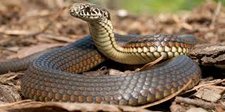
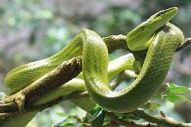
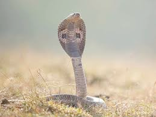

# snake (n)

/sneɪk/ [🔊](https://www.oxfordlearnersdictionaries.com/media/english/uk_pron/s/sna/snake/snake__gb_2.mp3) [🔊](https://www.oxfordlearnersdictionaries.com/media/english/us_pron/s/sna/snake/snake__us_1.mp3)

## (Animals) a reptile with a very long thin body and no legs. There are many types of snake, some of which are poisonous. (con rắn)

