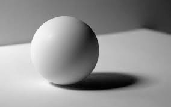

# sphere (n)

- /sfɪə(r)/ [🔊](https://www.oxfordlearnersdictionaries.com/media/english/uk_pron/s/sph/spher/sphere__gb_1.mp3)
- /sfɪr/ [🔊](https://www.oxfordlearnersdictionaries.com/media/english/us_pron/s/sph/spher/sphere__us_1.mp3)

## a solid figure that is completely round, with every point on its surface at an equal distance from the center

Topic [Colours and Shapes](../topics/colours-and-shapes.md#colours--shapes)

Hình cầu; Khối cầu

- perfect sphere