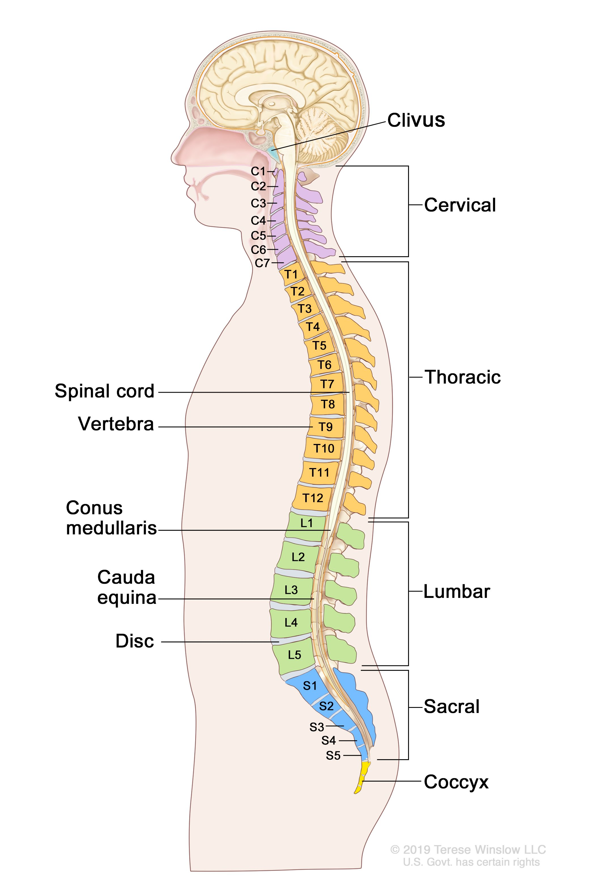

# spinal cord (n)

- /ˈspaɪnl kɔːd/ [🔊](https://www.oxfordlearnersdictionaries.com/media/english/uk_pron/s/spi/spina/spinal_cord_1_gb_2.mp3)
- /ˈspaɪnl kɔːrd/ [🔊](https://www.oxfordlearnersdictionaries.com/media/english/us_pron/s/spi/spina/spinal_cord_1_us_2.mp3)

spi-nal-cord /ˈspaɪ-nl-kɔːd/

## 1.

### the cylindrical bundle of nerve fibers and associated tissue which is enclosed in the spine and connects nearly all parts of the body to the brain, with which it forms the central nervous

tủy sống

