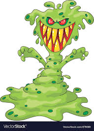

# spot (n)

- /spɒt/ [🔊](https://www.oxfordlearnersdictionaries.com/media/english/uk_pron/s/spo/spot_/spot__gb_1.mp3)
- /spɑːt/ [🔊](https://www.oxfordlearnersdictionaries.com/media/english/us_pron/s/spo/spot_/spot__us_1.mp3)

## a small round area that has a different colour or feel different from the surface it is on (đốm)

- a monster that has spots

- a dog that has spots

