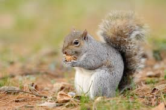

# squirrel (n)

- /ˈskwɪrəl/ [🔊](https://www.oxfordlearnersdictionaries.com/media/english/uk_pron/s/squ/squir/squirrel__gb_1.mp3)
- /ˈskwɜːrəl/ [🔊](https://www.oxfordlearnersdictionaries.com/media/english/us_pron/s/squ/squir/squirrel__us_1.mp3)

## a small animal with a long, thick tail and red, gray, or black fur. Squirrels eat nuts and lives in trees (con sóc)

