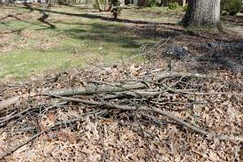
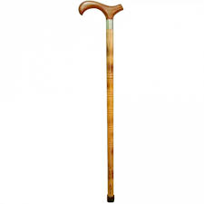
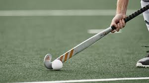

# stick (n)

/stɪk/ [🔊](https://www.oxfordlearnersdictionaries.com/media/english/uk_pron/s/sti/stick/stick__gb_1.mp3) [🔊](https://www.oxfordlearnersdictionaries.com/media/english/us_pron/s/sti/stick/stick__us_1.mp3)

## a thin piece of wood that has fallen or been broken from a tree

Củi; Que củi

## a stick that you carry and use as a support when you are walking

Gậy; Gậy ba tong

## a long, thin object that is used in some sports to hit or control the ball

Topic [Sports: ball and racket sports](../topics/sports-ball-and-racket-sports.md#sports-ball--racket-sports)

