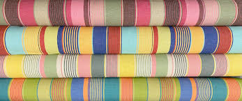

# stripe (n)

/straɪp/ [🔊](https://www.oxfordlearnersdictionaries.com/media/english/uk_pron/s/str/strip/stripe__gb_1.mp3) [🔊](https://www.oxfordlearnersdictionaries.com/media/english/us_pron/s/str/strip/stripe__us_1.mp3)

## a long narrow line of colour, that is a different colour from the areas next to it (sọc; vằn)

