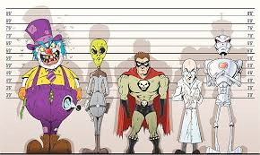

# supervillain (n)

- /ˈsuːpəvɪlən/ [🔊](https://www.oxfordlearnersdictionaries.com/media/english/uk_pron/s/sup/super/supervillain__gb_1.mp3)
- /ˈsuːpərvɪlən/ [🔊](https://www.oxfordlearnersdictionaries.com/media/english/us_pron/s/sup/super/supervillain__us_1.mp3)

## a very bad character in a story, especially one with magic powers (siêu ác nhân)

