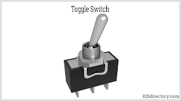

# switch (n)

/swɪtʃ/ [🔊](https://www.oxfordlearnersdictionaries.com/media/english/uk_pron/s/swi/switc/switch__gb_1.mp3) [🔊](https://www.oxfordlearnersdictionaries.com/media/english/us_pron/s/swi/switc/switch__us_1.mp3)

## (Engineering) a small device that you press or move up and down in order to turn a light or piece of electrical equipment on and off (công tắc)

## a change from one thing to another, especially when this is sudden and complete (sự thay đổi đột ngột)