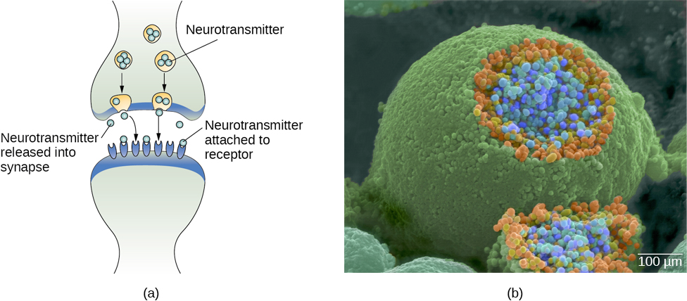

# synapse (n)

- /ˈsaɪnæps/ [🔊](https://www.oxfordlearnersdictionaries.com/media/english/uk_pron/s/syn/synap/synapse__gb_1.mp3) [🔊](https://www.oxfordlearnersdictionaries.com/media/english/us_pron/s/syn/synap/synapse__us_1.mp3)
- /ˈsɪnæps/ [🔊](https://www.oxfordlearnersdictionaries.com/media/english/uk_pron/s/syn/synap/synapse__gb_2.mp3) [🔊](https://www.oxfordlearnersdictionaries.com/media/english/us_pron/s/syn/synap/synapse__us_2.mp3)

sy-napse /ˈsaɪ-næps/

## 1.

### a junction between two nerve cells, consisting of a minute gap across which impulses pass by diffusion of a neurotransmitter

