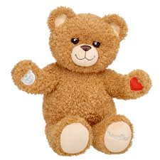

# teddy bear (n)

- /ˈtedi beə(r)/ [🔊](https://www.oxfordlearnersdictionaries.com/media/english/uk_pron/t/ted/teddy/teddy_bear_1_gb_3.mp3)
- /ˈtedi ber/ [🔊](https://www.oxfordlearnersdictionaries.com/media/english/us_pron/t/ted/teddy/teddy_bear_1_us_1.mp3)

## (Games and toys) a soft toy bear (gấu bông)

