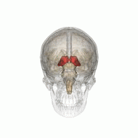

# thalamus (n)

/ˈθæləməs/ [🔊](https://www.oxfordlearnersdictionaries.com/media/english/uk_pron/t/tha/thala/thalamus__gb_1.mp3) [🔊](https://www.oxfordlearnersdictionaries.com/media/english/us_pron/t/tha/thala/thalamus__us_1.mp3)

tha-la-mus /ˈθæ-lə-məs/

plural **thalami** /ˈθæləmaɪ/ [🔊](https://www.oxfordlearnersdictionaries.com/media/english/uk_pron/t/tha/thala/thalami__gb_2.mp3) [🔊](https://www.oxfordlearnersdictionaries.com/media/english/us_pron/t/tha/thala/thalami__us_2.mp3)

## 1.

### Anatomy - a paired structured of grey matter is located near the center of the brain and generally believed to act as a relay station between subcortical areas and the cerebral cortex

đồi thị

- There is evidence that Krista and Tatiana Hogan, a Canadian twin girls, are connected in the thalamus, which is a major sensory relay center.
- Most incoming sensory information is sent through the thalamus before reaching higher regions of the cerebral cortex for processing.

## Reference

- [Wikipedia. (n.d.). *Thalamus*.](https://en.wikipedia.org/wiki/Thalamus)