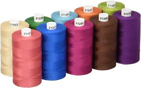
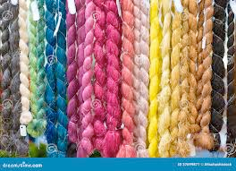

# thread (n)

/θred/ [🔊](https://www.oxfordlearnersdictionaries.com/media/english/uk_pron/t/thr/threa/thread__gb_1.mp3) [🔊](https://www.oxfordlearnersdictionaries.com/media/english/us_pron/t/thr/threa/thread__us_1.mp3)

## a thin string of cotton, wool, silk, etc. used for sewing or making cloth

Sợi

## an idea or a feature that is part of something greater; an idea that connects the different parts of something

- common thread
- different threads
- lost the thread (forgot)

## a long, thin line of something

- thread of light

## a series of connected messages on email, social media, etc. that have been sent by different people

Topic [Phone, email, and the internet](../topics/phones-email-and-the-internet.md#phones-email--the-internet)

Luồng

## the raised line that runs around the length of a screw and that allows it to be fixed in place by twisting

Răng

## clothes