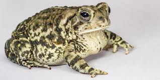
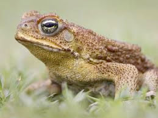

# toad (n)

/təʊd/ [🔊](https://www.oxfordlearnersdictionaries.com/media/english/uk_pron/t/toa/toad_/toad__gb_1.mp3) [🔊](https://www.oxfordlearnersdictionaries.com/media/english/us_pron/t/toa/toad_/toad__us_1.mp3)

## 1.

### a tailless amphibian with a short stout body and short legs, typically having dry warty skin that can exude poison

[More about toads](toad.pdf)

## 2.

### a contemptible or detestable person (used as a general term of abuse)