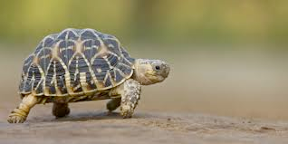
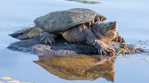

# turtle (n)

- /ˈtɜːtl/ [🔊](https://www.oxfordlearnersdictionaries.com/media/english/uk_pron/t/tur/turtl/turtle__gb_2.mp3)
- /ˈtɜːrtl/ [🔊](https://www.oxfordlearnersdictionaries.com/media/english/us_pron/t/tur/turtl/turtle__us_2.mp3)

## (Animals) a reptile with a large round shell, e.g., tortoise or terrapin (con rùa)

