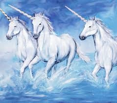
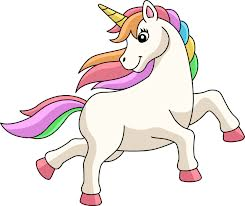

# unicorn (n)

- /ˈjuːnɪkɔːn/ [🔊](https://www.oxfordlearnersdictionaries.com/media/english/uk_pron/u/uni/unico/unicorn__gb_1.mp3)
- /ˈjuːnɪkɔːrn/ [🔊](https://www.oxfordlearnersdictionaries.com/media/english/us_pron/u/uni/unico/unicorn__us_1.mp3)

## (in stories) an animal like a white horse with a long straight horn on its head (con kì lân)

## a new company valued at more than one billion dollars, typically in the software or technology sector