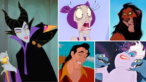

# villain (n)

/ˈvɪlən/ [🔊](https://www.oxfordlearnersdictionaries.com/media/english/uk_pron/v/vil/villa/villain__gb_1.mp3) [🔊](https://www.oxfordlearnersdictionaries.com/media/english/us_pron/v/vil/villa/villain__us_1.mp3)

## (File or theatre, Literature and writing) the main bad character in a story, play, etc. (nhân vật phản diện)

