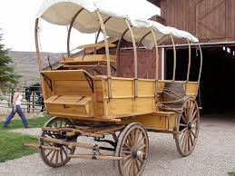
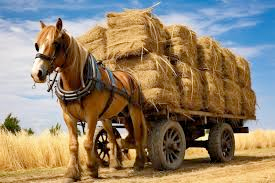
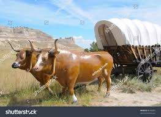

# wagon (n)

/ˈwæɡən/ [🔊](https://www.oxfordlearnersdictionaries.com/media/english/uk_pron/r/ree/reef_/reef__gb_1.mp3) [🔊](https://www.oxfordlearnersdictionaries.com/media/english/us_pron/r/ree/reef_/reef__us_1.mp3)

## (Transport) a vehicle with four wheels, pulled by horses or oxen and used for carrying heavy loads (xe ngựa/bò)

## (Transport) a railway truck for carrying goods ()