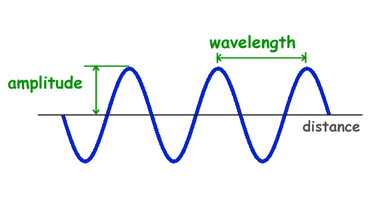

# wavelength (n)

/ˈweɪvleŋkθ/ [🔊](https://www.oxfordlearnersdictionaries.com/media/english/uk_pron/w/wav/wavel/wavelength__gb_2.mp3) [🔊](https://www.oxfordlearnersdictionaries.com/media/english/us_pron/w/wav/wavel/wavelength__us_1_rr.mp3)

wave-length /ˈweɪv-leŋkθ/

plural **wavelengths**

## 1.

### Physics - the distance between successive crests of a wave, especially points in a sound wave or electromagnetic wave

bước sóng

- Wavelength and frequency are inversely related so that longer waves have lower frequencies, and shorter waves has higher frequencies.

### a wavelength as a distinctive feature of radio waves from a transmitter

## 2.

### a person's ideas and way of thinking, especially as it affects their ability to communicate with others